# UnFoldAI

## Overview

UnFoldAI is an intelligent research and account-planning assistant designed to help users analyze companies and generate structured strategic insights through natural conversation. The system integrates external web research with user-provided documents, resolves information inconsistencies, and produces an editable account plan in a structured format. The agent adapts its interaction style to different user behaviors, allowing for efficient or guided workflows depending on user intent.

## Key Features

- **Conversational Account Planning**
  Generate, review, and refine account plans through natural language interaction (text or voice).

- **Automated Web Research**
  Uses Perplexity search to retrieve real-time company data, news, and insights.

- **Structured Plan Editing**
  Supports precise updates via a controlled JSON update protocol (replace, append, merge, move, delete).

- **Conflict Detection & Resolution**
  Automatically identifies inconsistent information and prompts the user to resolve or initiate deeper research.

- **Deep Research Mode**
  Breaks complex requests into multi-step plans with progress tracking and incremental updates.

- **Document-Aware Reasoning**
  Allows file uploads, referencing, and integration of insights into the plan (via OpenAI Files).

- **Versioned State Management**
  Every plan update is snapshotted, allowing rollback, comparison, and session continuity.


# System Architecture

```mermaid
flowchart TB
    %% User Layer
    User(["👤 User"])
    
    %% Frontend
    subgraph Frontend["React + Tailwind"]
        direction TB
        UI["Chat Interface<br/>Voice I/O<br/>Plan Viewer"]
    end
    
    %% Backend
    subgraph Backend["⚙️ FastAPI Backend"]
        direction TB
        API["REST API Layer"]
        FileHandler["File Upload &<br/>Ingestion Handler"]
        SessionManager["Session Manager<br/>+ Versioning"]
        PlanEngine["Plan Update Engine<br/>(JSON Protocol)"]
    end
    
    %% RAG & Knowledge Base (NEW)
    subgraph KnowledgeBase["🧠 RAG & Knowledge Base"]
        direction TB
        DocProcessor["Document Chunking<br/>& Processing"]
        EmbeddingSvc["Embedding Service<br/>(OpenAI)"]
        FAISS[("FAISS<br/>Vector Store")]
    end

    %% Orchestration
    subgraph Orchestrator["🤖 LangGraph Agent Orchestration"]
        direction TB
        Control{"Determine<br/>Next Action"}
        RetrievalNode["RAG Retrieval Node<br/>(Query FAISS)"]
        ConvNode["Conversation Node<br/>(GPT-4o)"]
        ResearchNode["Research Node<br/>(Perplexity API)"]
        ConflictResolver["Conflict Detection<br/>& Resolution"]
    end
    
    %% Storage
    subgraph Storage["💾 State & Persistence"]
        direction TB
        PlanState["Account Plan<br/>Document State"]
        VersionHistory["Historical<br/>Snapshots"]
        Sources["Research Source<br/>Registry"]
        Conflicts["Conflict<br/>Records"]
        FileMeta["File Metadata<br/>(SQL/NoSQL)"]
    end
    
    %% External Services
    subgraph External["🌐 External Systems"]
        direction TB
        Perplexity["Perplexity<br/>Web Search"]
        OpenAI["OpenAI API<br/>(LLM & Embeddings)"]
        Deepgram["Deepgram<br/>TTS"]
    end
    
    %% Connections - User Flow
    User -->|Text or Voice| UI
    UI -->|Message + Context| API
    
    %% Backend Flow
    API --> SessionManager
    API --> Orchestrator
    
    %% Ingestion Flow (New)
    FileHandler -->|Raw File| DocProcessor
    DocProcessor -->|Text Chunks| EmbeddingSvc
    EmbeddingSvc -->|Vectors| FAISS
    FileHandler -->|Ref ID| FileMeta
    EmbeddingSvc -.->|Request| OpenAI
    
    %% Orchestration Flow
    SessionManager --> Control
    
    Control -->|Local Context Needed| RetrievalNode
    Control -->|External Info Needed| ResearchNode
    Control -->|Direct Response| ConvNode
    
    RetrievalNode -->|Context Blocks| ConvNode
    ResearchNode -->|Web Context| ConflictResolver
    
    ConflictResolver --> ConvNode
    ConvNode -->|Structured JSON| API
    
    %% RAG Retrieval Logic
    RetrievalNode -->|Similarity Search| FAISS
    FAISS -->|Top-K Chunks| RetrievalNode
    
    %% State Management
    SessionManager --> PlanState
    SessionManager --> VersionHistory
    
    ResearchNode --> Sources
    ResearchNode --> Perplexity
    
    ConflictResolver --> Conflicts
    
    PlanEngine --> PlanState
    
    UI --> Deepgram
```




## Architecture Overview

UnFoldAI is designed using a modular, layered architecture that balances usability, agentic autonomy, and reliable execution. Each layer contributes to natural conversational interactions while maintaining structured, controllable system behavior.

---

### **Frontend Layer**

- **React + Vite + Tailwind** — modern, high-performance UI stack  
- **Chat Interface** — primary text interaction channel  
- **Voice Input/Output** — optional speech-based interaction  
- **Plan Viewer** — interactive visual rendering of the evolving account plan  

---

### **Backend Layer**

- **FastAPI** — core REST service layer  
- **File Handler** — uploads, processes, and embeds documents for retrieval  
- **Session Manager** — maintains per-session state, plan versions, and metadata  
- **Plan Engine** — applies structured JSON updates to the account plan  

---

### **Orchestration Layer**

- **LangGraph Agent** — central reasoning and control orchestrator  
- **Retrieval Node (FAISS)** — queries local vector store for document context  
- **Conversation Node (GPT-4o)** — handles natural language understanding and structured responses  
- **Research Node (Perplexity API)** — retrieves real-world data during analysis  
- **Conflict Resolver** — detects contradictory data and initiates resolution loops  

---

### **Storage Layer**

- **Account Plan State** — canonical structured artifact  
- **Vector Store (FAISS)** — local index for high-speed similarity search  
- **Version History** — time-travel model of edits  
- **Source Registry** — consolidated evidence and citations  
- **Conflict Records** — tracked unresolved and resolved discrepancies  
- **File Metadata** — inline reference objects for uploaded files  

---

### **External Systems**

- **Perplexity** — live web research retrieval  
- **OpenAI API** — embedding generation and LLM inference  
- **Deepgram** — natural-sounding text-to-speech

---

### Why This Architecture ?
Design Philosophy ~ “The agent should think deeply, but interact simply.”

The architecture reflects core objectives: reliability, controllability, contextual grounding, and adaptive intelligence.

- **Layered separation ensures clarity of responsibility.**
  The frontend manages interaction and presentation, the backend handles system logic, and LangGraph governs reasoning and action sequencing.

- **Agentic orchestration supports decision-based workflows.**
  Instead of a single prompt-response loop, the orchestrator determines whether to answer, **retrieve local context**, research, refine, or resolve conflicts—enabling iterative reasoning rather than single-turn output.

- **Structured updates provide safe manipulation of persistent state.**
   The JSON protocol prevents unbounded text editing and enables deterministic updates to the account plan.

- **Hybrid retrieval unifies internal and external knowledge.**
  By combining FAISS for local document indexing and Perplexity for web research, the system grounds responses in both private user data and real-time market intelligence.

- **Stateful design enables context durability and reproducibility.**
  Sessions, version history, conflicts, and sources are preserved, allowing the agent to perform multi-step analysis over time rather than reset on each request.

- **Service modularity supports extensibility.**
  Search, **vector retrieval**, speech, and file analysis are independent components, making the system adaptable and maintainable as capabilities evolve.


## ⚙️ Setup & Installation

### 1. Clone
```bash
git clone https://github.com/saai-srivathsan/UnFoldAI.git
cd UnFoldAI
```

### 2. Backend (FastAPI)
```bash
cd backend
python -m venv env
source env/bin/activate  # Windows: .\env\Scripts\activate
pip install -r requirements.txt
```

Create `backend/.env`:

```
OPENAI_API_KEY=your_key
PERPLEXITY_API_KEY=your_key
DEEPGRAM_API_KEY=optional
OPENAI_MODEL=gpt-4o
```

Run backend:
```bash
uvicorn main:api --reload
```

### 3. Frontend (React + Vite)
```bash
npm install
npm run dev
```

### 4. Access
- Frontend: http://localhost:5173  
- Backend API docs: http://127.0.0.1:8000/docs  

---

To reset stored state, delete: `backend/sessions.json`


